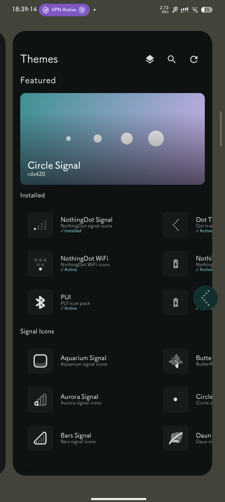
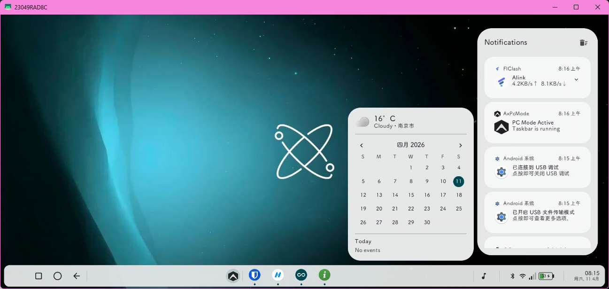
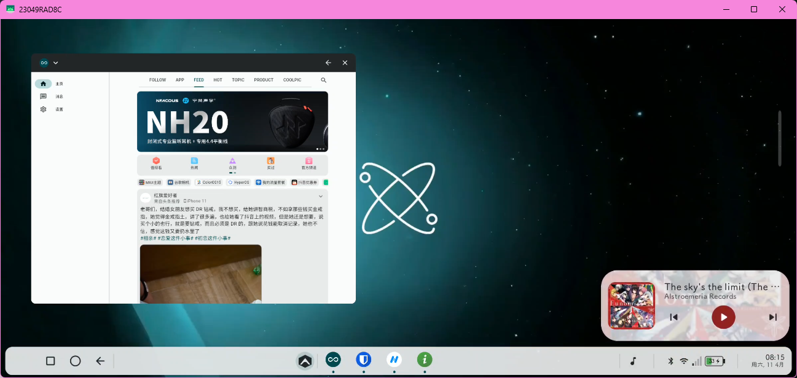
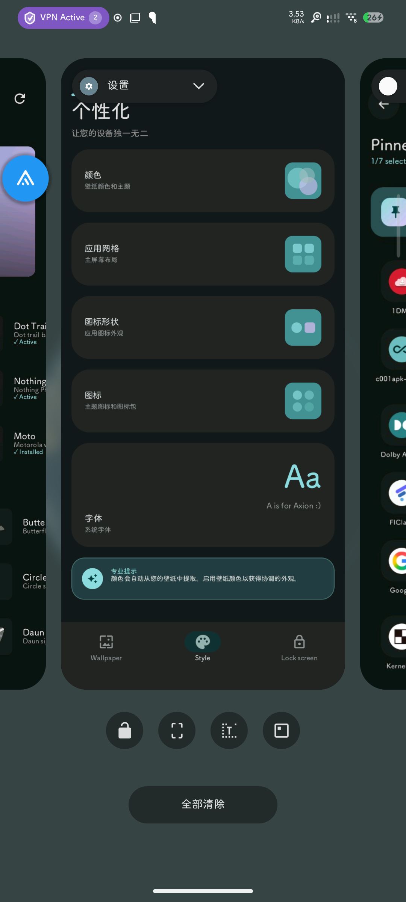
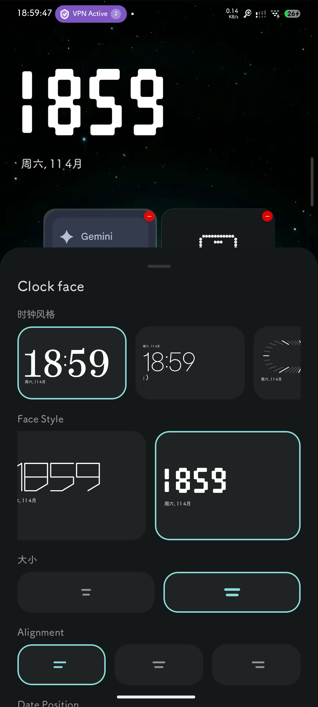
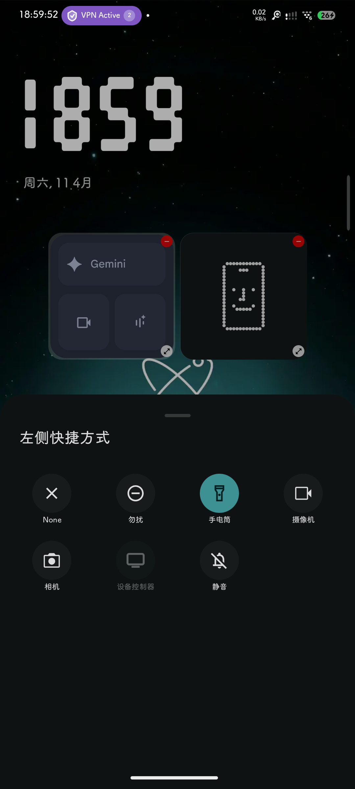
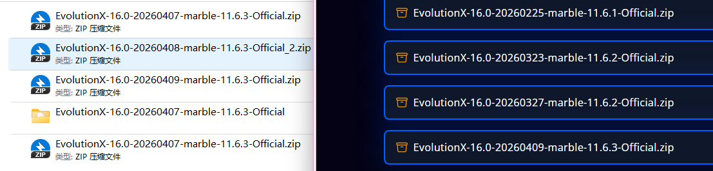

## 前言

拿到了一台红米Note 12 Turbo aka.Marble, 16GB+1TB配置.

然后发现官方给了个init HyperOS3 然后就EOL了, 连实时通知都没给, 所以决定用类原生了.  

上次正式日用类原生还是MI 5X aka.Tiffany, 也快十年了, 那时候很喜欢 AOSP-Extended aka.AEX,  可惜已经EOL了.  

拿到手是HyperOS3, 有提权漏洞, 拿到temp su然后授权shell dd刷入工程包abl, 重启fastboot刷入工程全包, 进入fastbootd干掉avb计数, 然后刷入MIUI14绑定BL, 七天后解开.  这些不在话下.  

## 结论

核心需求：自定义界面图标包, 自定义字体(全局生效), 完善的后台界面, 优雅的界面.  

并且考虑到类原生更容易触发风控, 猫鼠游戏自然是踪迹越少越好隐藏.

这样一看AxionOS非常好, 他的某些小功能甚至让我很惊喜

这次我甚至没装MetaModule和启用了默认卸载模块, 因为不再用某些模块了.  ~~PUI, unlock-cn-gms, MFGA~~

所以我决定把AxionOS从下面的else提到上面来着重讲了

### AxionOS

名字挺眼熟, 至于是不是致敬削除我也不知道.  

体验不错, 无LAG没恶性BUG

LOS Style挺好的, 包括的GMS组件很克制.  

看着应该是DynamicBar和主题引擎（类Substratum功能）的源头, 动画优雅, 完全正常工作.  

体验到了DEX Powered by Samsung了, 谷歌这次做对了

启动器很棒, 这次不用Lawnchair了, 图标包放在个性化与样式里了, ~~我就说MOTO是对的~~, 顺带一提我觉得气泡才是类原生上小窗的最优解

锁屏页面支持小组件自定义, iconify是对的, 可惜死在了HOOK, 我觉得Overlay是好文明, 不过国内的厂商的穿戴都喜欢搞私有组件那一套, 不太喜欢.  

## 其他AOSP ROM

### PixelOS 

Stock好看, 但是我选择PE-Plus, pe你在哪，，，

### EvolutionX aka.KangX

依旧Cherry-Picker大手, 

依旧pick也不同步上游更新, 

依旧混杂冲突, 

依旧日用BUG, 

依旧git reset --soft HEAD~1 && git push origin --force 一气呵成

就我用的这几天, 已经撤了N个包了

BugList（不完全）

自定义字体冲突, 只有部分允许自定义, 比如标题；

实时窗不同步上游导致flood, 某些显示N/A；

~~对MTProto流量处理异常导致只能通过localhost:PORT上网, 气笑了~~ 关闭允许软件尝试绕过即可

同步上游搞了个类Substratum结果部分生效, 说起好玩的他自己的自定义充电动画和这个冲突.  

不支持快充

不过内置的开机动画让我想起之前的日子, DirtyUnicorn, ResurectionRemix, ctOS, 

~~果然人一老了就容易念旧~~

### Lunaris-AOSP
yet another cherry-pick project, 没啥好说的, 依旧大而杂, sync with EVOX

### ProjectInfinityX
之前以为和隔壁InfinityX是Fork关系, 结果是版本迭代.  

浅用了一会发现比隔壁的X好一点.  

有个实时环, 可以理解是电池条的迭代物, 也算是战斗天使眼睛的精神续作了, 至于另一只眼, 被小恐龙喷火烧炸了

### crDroid
老资历来了, 稳定, EXT4, 
不过我觉得界面太老了

## 注
\* [大] 属于一种主观感觉, 不存在实际度量意义