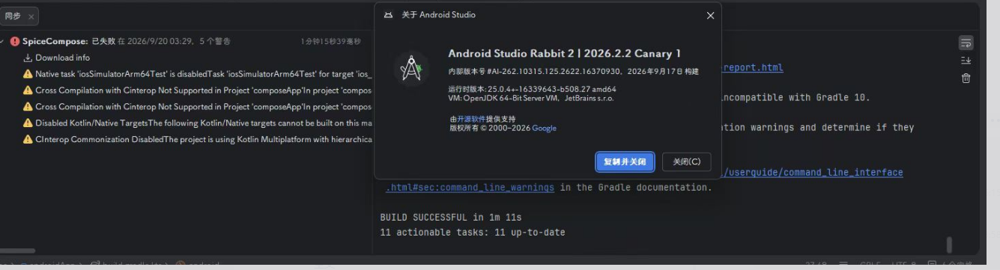
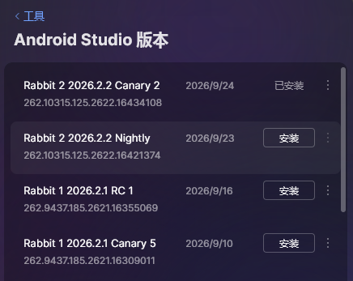

用的jetbrain toolbox

kmp还是快速迭代状态，所以被迫agp kotlin一堆都用beta渠道，as也不例外。

然后就杯具了。

排查了好几天，

Windows开新用户了，jdk26删掉换jdk25，as重装，环境变量删了又加，c指导o指导查了好多次，日志等级加了又加，疯狂checkout，嗯，无语了。

最后还是回滚了.

--------
0925：jetbra修好了，花了五天。。。推了canary2

并且canary1撤包了，气笑了。

也是真的当上金丝雀了

