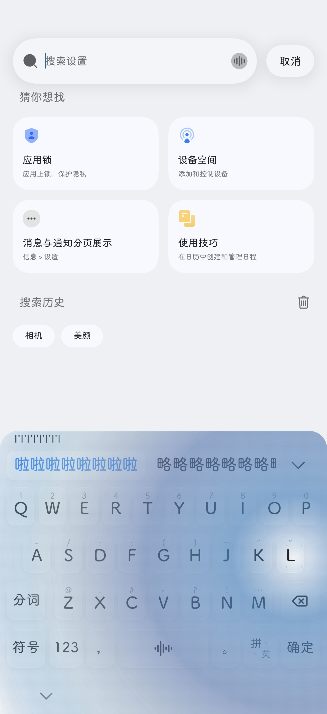
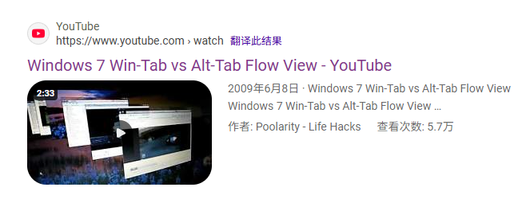

弄了个Samsung Keyscafe for Oplus_input.
一开始只是想着搞个全局液态玻璃。毕竟一个发版的生产级渠道软件只支持八个场景下的液态玻璃材质显示真的很搞笑。

```jvav
public abstract class d {
    // 只有这 8 个系统自带应用在模糊白名单中：
    public static final ArrayList f13652b = kotlin.collections.n.R(
        "com.heytap.quicksearchbox",  // 全局搜索
        "com.heytap.speechassist",   // 小布助手
        "com.android.contacts",      // 联系人
        "com.android.settings",      // 系统设置
        "com.heytap.market",         // 软件商店
        "com.oplus.aimemory",        // AI 记忆
        "com.coloros.filemanager",   // 文件管理
        "com.oplus.tips"             // 玩机技巧
    );
}
```

后面想了一下，多做了一些功能。
尝试把三星输入法的相关灯效/动效移植进来了。
效果还不错。
<div align="center">

</div>

说实话，光效跑起来的时候挺鸟肌的。

也算是了却一番心愿了吧。

--- 
想到了液态玻璃，多嘴几句吧。现在厂商都在跟进苹果，我觉得挺遗憾的。明明玻璃效果的老祖是windows vista/7

我小学的时候被 Windows 7 的 win+tab 震惊到的了。我真的没见过那么优雅的动效。
<div align="center">

</div>

那个时候iOS普遍需要越狱(虽然现在也还是有越狱的必要的)，Android更不必多说，原生系统的浅暗支持印象里是Oreo前后才有的。那段日子真的，MIUI打遍天下无敌手，ColorOS和Funtouch一样给我很简陋的感觉；至于华为系，我的感觉就是那种山寨商务机的界面，那个图标我一看到就觉得很丑，或许也单纯因为我讨厌拟物吧。很多时候有损压缩还是有必要的。


后面我学习ghost装机，记住了load from local后，把家里的电脑从winxp换成了windows7.结果一直触发不了win+tab，只有alt+tab正常工作。那时我很苦恼，但随后又被桌面挂件吸引了过去，倒是津津有味地玩起了数独游戏。

很多年之后才知道，ghost不是唯一的装机方法，并且ghost装机大多数是阉割版的，这里面就包括了那个动效。和Ra2的过场动画/语音一样，成为了一段局限于历史的残缺。

至于三星，祝他好运。和Apple一样仗着作为辛迪加就不思进取。哎...

我赌 iPad Air 上高刷先于 Galaxy Tab重回高通，当然，你别给我上Exynos我就算谢天谢地了。